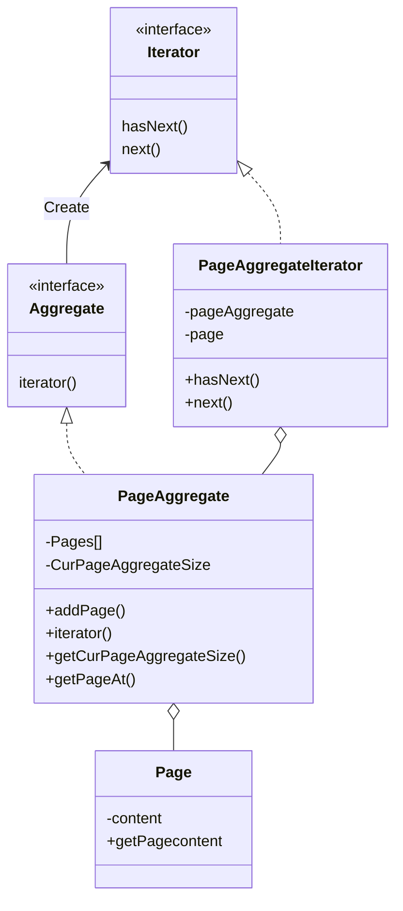

### design_mode homework02

#### Iterator

```mermaid
classDiagram
class Aggregate{
<<interface>>
iterator()
}
class Iterator{
<<interface>>
hasNext()
next()
}
class PageAggregate{
-Pages[]
-CurPageAggregateSize
+addPage()
+iterator()
+getCurPageAggregateSize()
+getPageAt()
}
class PageAggregateIterator{
-pageAggregate
-page
+hasNext()
+next()
}
class Page{
-content
+getPagecontent
}
Iterator<|..PageAggregateIterator
Aggregate<|..PageAggregate
Iterator <-- Aggregate:Create
PageAggregateIterator o-- PageAggregate
PageAggregate o-- Page
```

#### 