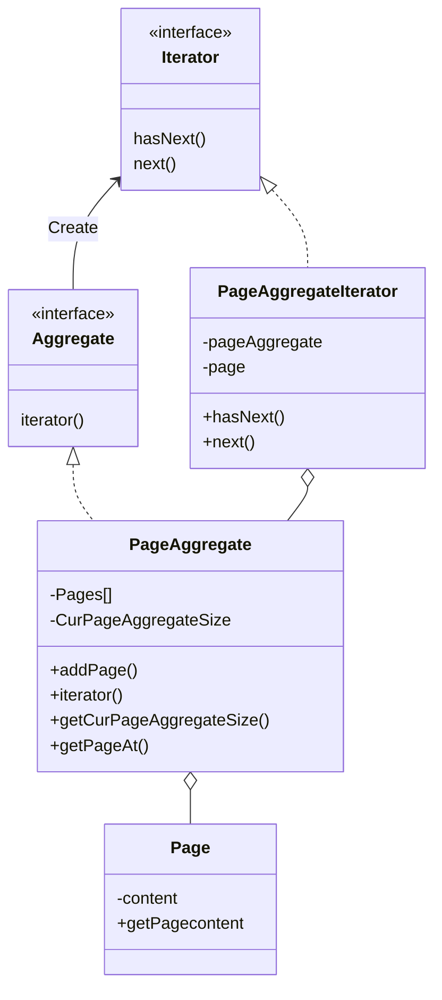
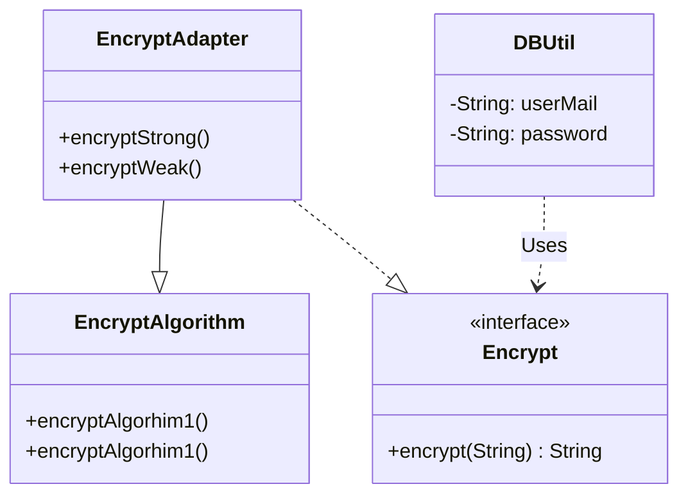
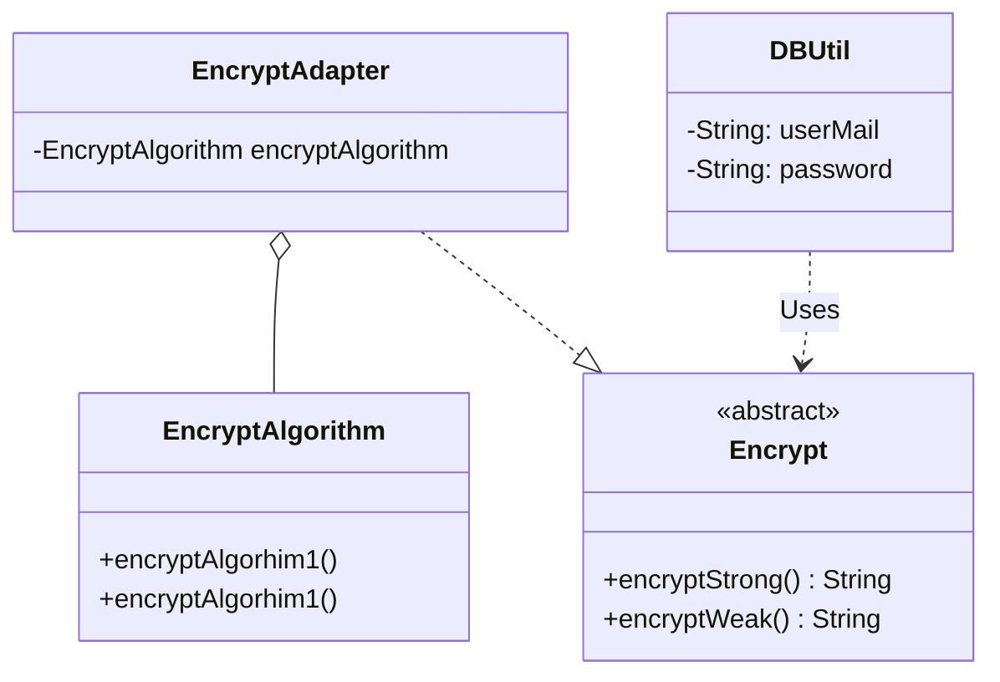
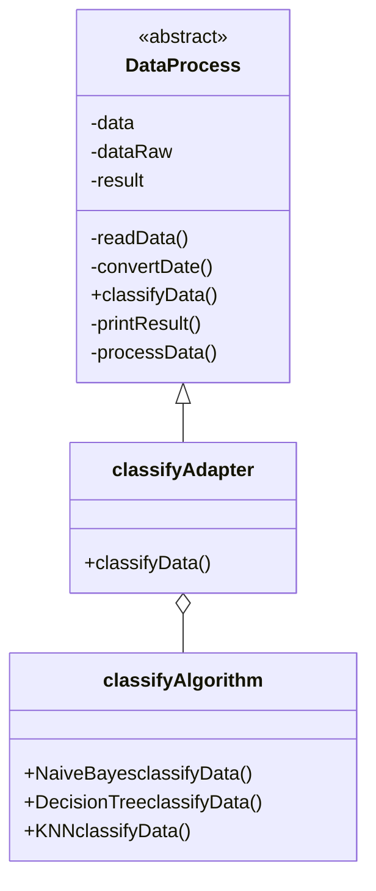
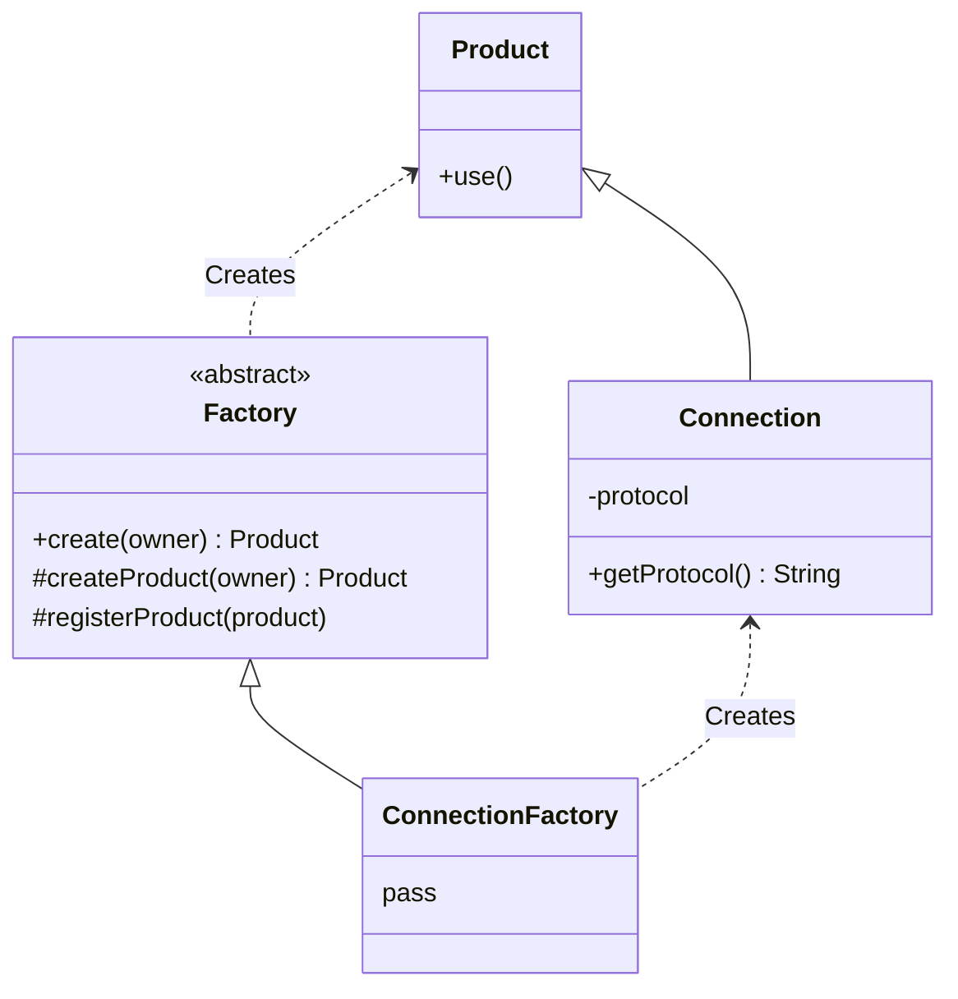
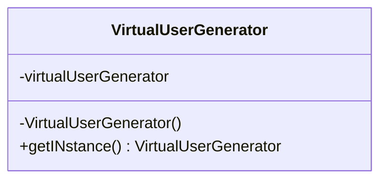
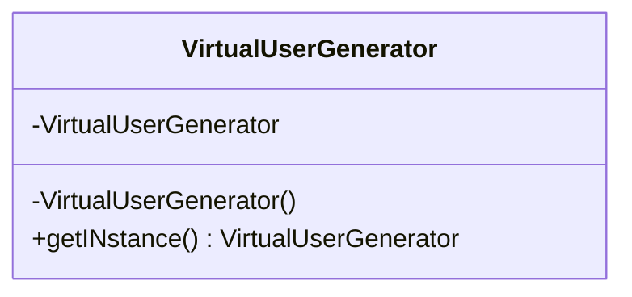
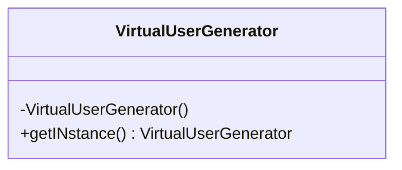
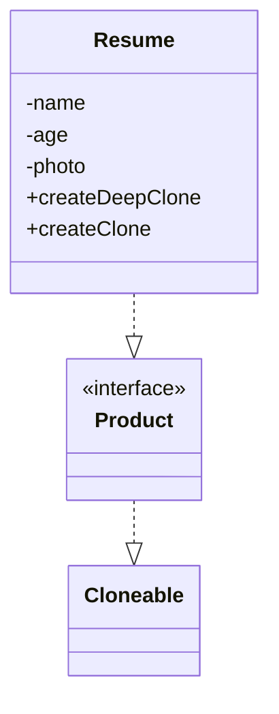

### design_mode homework02 	实验报告

#### Iterator

#### class adapter

#### object adapter

#### template

#### factory

#### Singleton

饿汉单例式

双重检测锁

loDH

### prototype

### 实验小结

通过对上课所讲模式的code，对不同模式有了更深的理解，原型模式可以通过复制已有对象来创建对象来减小成本，遇到的问题是对模式不太熟悉，导致在实际编程时，对类与接口的实际实现上手比较困难，解决方法，观看上课课件，上网查资料解决

