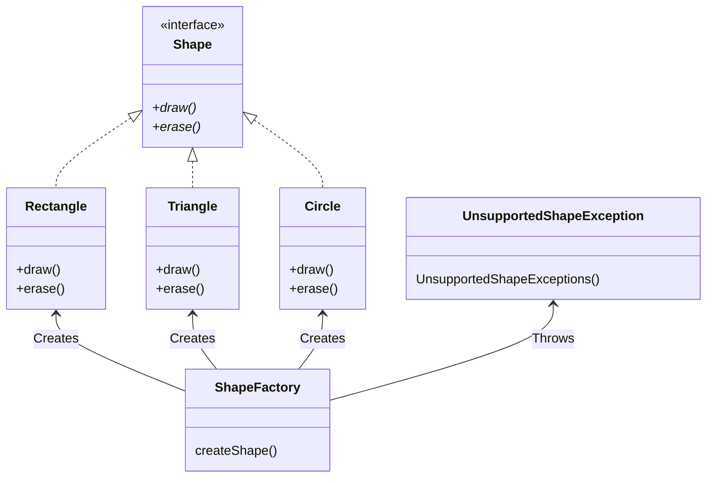
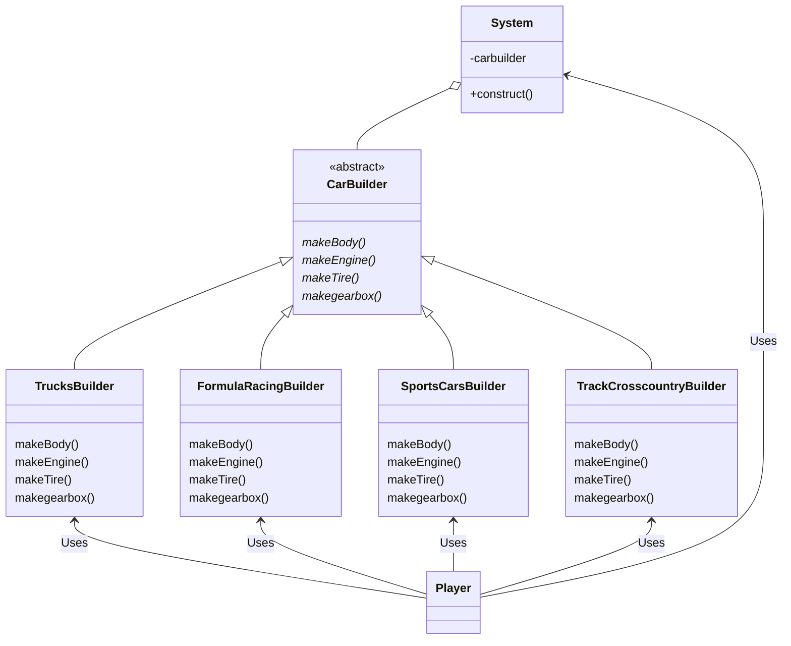
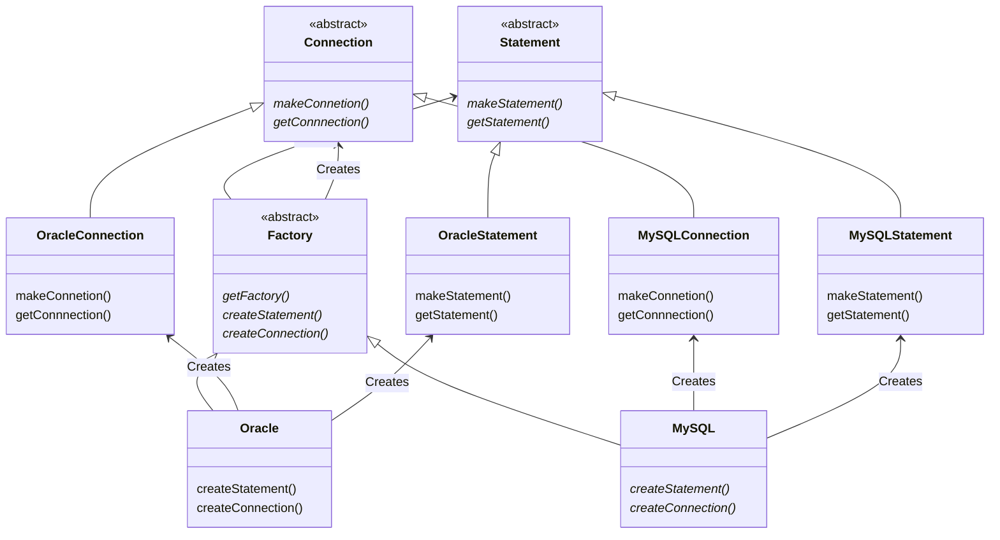
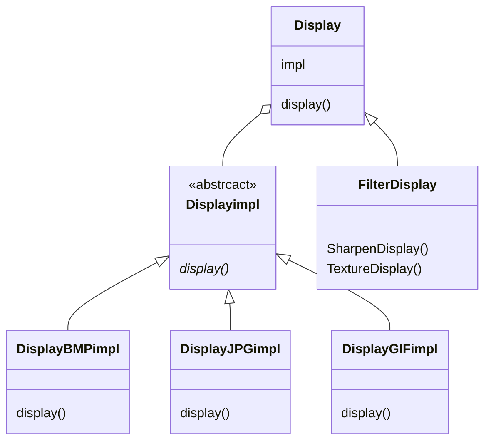
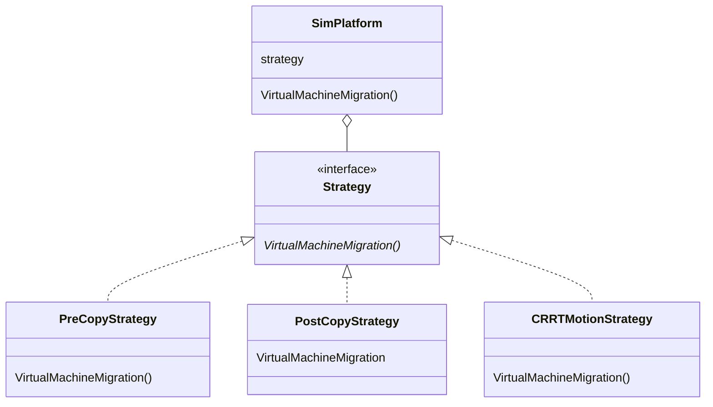

### design_mode_hw03_uml

#### Simple Factory

```mermaid
classDiagram
class Shape{
<<interface>>
+draw()*
+erase()*
}
class Circle{
+draw()
+erase()
}
class Rectangle{
+draw()
+erase()
}
class Triangle{
+draw()
+erase()
}
class ShapeFactory{

createShape()
}

class UnsupportedShapeException{
UnsupportedShapeExceptions()
}
Shape <|.. Circle
Shape <|.. Triangle
Shape <|.. Rectangle
Rectangle <--  ShapeFactory:Creates
Triangle <-- ShapeFactory :Creates
Circle <-- ShapeFactory :Creates
UnsupportedShapeException <-- ShapeFactory :Throws
```

#### Builder

```mermaid
classDiagram
class System{
	-carbuilder
	+construct()
}
class Player{
	
}
class CarBuilder{
<<abstract>>
makeBody()*
makeEngine()*
makeTire()*
makegearbox()*
}
class FormulaRacingBuilder{
makeBody()
makeEngine()
makeTire()
makegearbox()
}
class TrackCrosscountryBuilder{
makeBody()
makeEngine()
makeTire()
makegearbox()
}
class SportsCarsBuilder{
makeBody()
makeEngine()
makeTire()
makegearbox()
}
class TrucksBuilder{
makeBody()
makeEngine()
makeTire()
makegearbox()
}
CarBuilder <|-- TrucksBuilder
CarBuilder <|-- FormulaRacingBuilder
CarBuilder <|-- SportsCarsBuilder
CarBuilder <|-- TrackCrosscountryBuilder
System o-- CarBuilder
TrackCrosscountryBuilder <-- Player :Uses
SportsCarsBuilder <-- Player :Uses
FormulaRacingBuilder <-- Player :Uses
System <-- Player :Uses
TrucksBuilder <-- Player :Uses
```

### Abstract Factory

```mermaid
classDiagram
class Factory{
<<abstract>>
getFactory()*
createStatement()*
createConnection()*
}
class Statement{
<<abstract>>
makeStatement()*
getStatement()*
}
class Connection{
<<abstract>>
makeConnetion()*
getConnnection()*
}
class MySQL{
createStatement()*
createConnection()*
}
class MySQLStatement{
makeStatement()
getStatement()
}
class MySQLConnection{
makeConnetion()
getConnnection()
}
class OracleStatement{
makeStatement()
getStatement()
}
class OracleConnection{
makeConnetion()
getConnnection()
}
class Oracle{
createStatement()
createConnection()
}
Statement <-- Factory :Creates
Connection <-- Factory :Creates
Statement <|-- OracleStatement
Statement <|--MySQLStatement
Connection <|-- MySQLConnection
Connection <|--OracleConnection
Factory <|-- Oracle
Factory <|-- MySQL
 OracleConnection <-- Oracle :Creates
 OracleStatement <-- Oracle :Creates
  MySQLConnection <-- MySQL :Creates
  MySQLStatement <--  MySQL :Creates

```

### Bridge

```mermaid
classDiagram
class Display{
impl
display()
}
class Displayimpl{
<<abstrcact>>
 display()*
}
class DisplayJPGimpl{
display()
}
class DisplayGIFimpl{
display()
}
class DisplayBMPimpl{
display()
}
class FilterDisplay{
SharpenDisplay()
TextureDisplay()
}
Display <|-- FilterDisplay
Display o--  Displayimpl
Displayimpl <|-- DisplayBMPimpl
Displayimpl <|-- DisplayJPGimpl
Displayimpl <|-- DisplayGIFimpl
```

### Strategy

```mermaid
classDiagram
class Strategy{
<<interface>>
VirtualMachineMigration()*
}
class PreCopyStrategy{
VirtualMachineMigration()
}
class PostCopyStrategy{
VirtualMachineMigration
}
class CRRTMotionStrategy{
VirtualMachineMigration()
}
class SimPlatform{
strategy
VirtualMachineMigration()
}
Strategy<|..PreCopyStrategy
Strategy<|..PostCopyStrategy
Strategy<|..CRRTMotionStrategy
SimPlatform o-- Strategy

```

