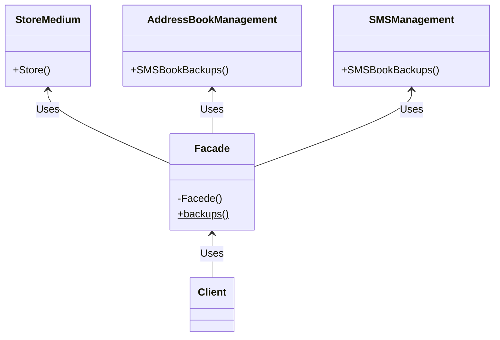
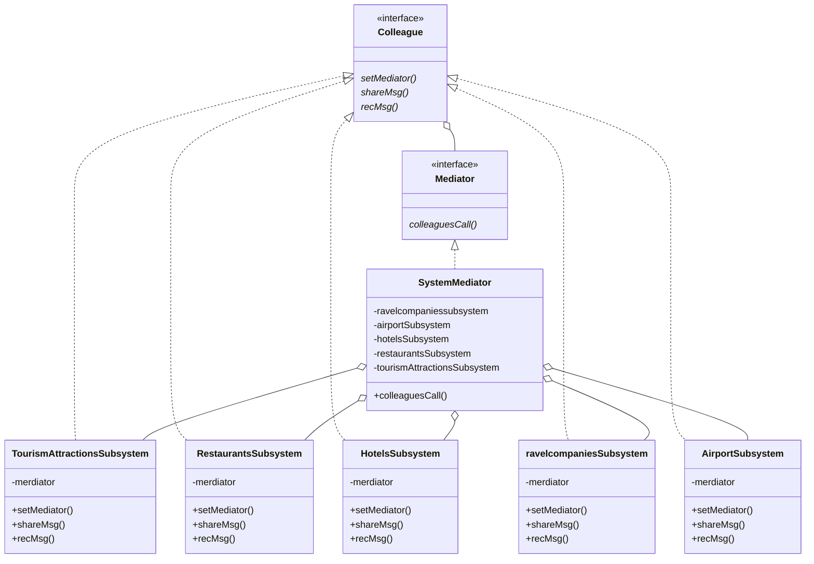
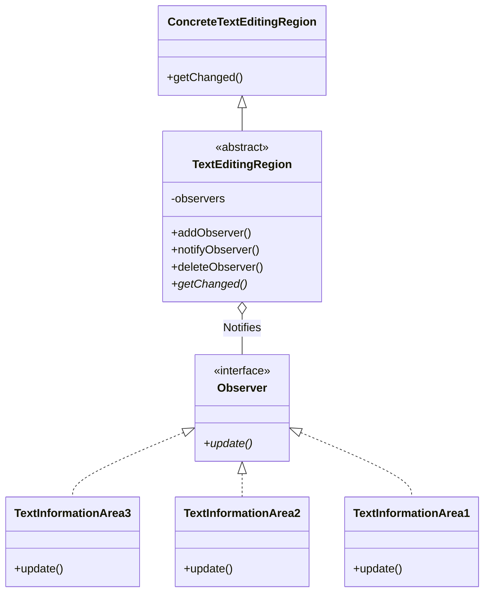
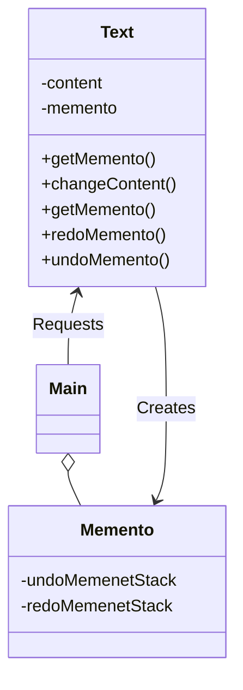

# DesignMode_lab4

## 一 实验目的

1. 结合实例，熟练绘制设计模式结构图。
2. 结合实例，熟练使用 Java 语言实现设计模式。
3. 通过本实验，理解每一种设计模式的模式动机，掌握模式结构，学习如何使用代码实现这些设计模式。

## 二 实验要求

1. 结合实例，绘制设计模式的结构图。
2. 使用 Java 语言实现设计模式实例，代码运行正确。

## 三 实验内容

### 1. 外观模式 Facade

某软件公司为新开发的智能手机控制与管理软件提供了一键备份功能，通过该功能可以
将原本存储在手机中的通讯录、短信、照片、歌曲等资料一次性全部拷贝到移动存储个质（例
如 MMC 卡或 SD 卡）中。在实现过程中需要与多个已有的类进行交互，例如通讯录管理
类、短信管理类等。为了降低系统的耦合度，试使用外观模式来设计并编程模拟实现该一键
备份功能。

### 2. 中介者模式

为了大力发展旅游业，某城市构建了一个旅游综合信息系统，该系统包括旅行社子系统
（ravel companies Subsystem）、宾馆子系统（HotelsSubsystem）、餐厅于系统( Restaurants
Subsystem )、机场子系统（Airport Subsystem）、旅游景点子系统（Tourism Attractions
Subsystem）等多个子系统，通过该旅游综合信息系统，各类企业之间可实现信息共享，一
家企业可以将客户信息传递给其他合作伙伴。例如，当一家旅行社有一些客户后，该旅行社
可以将客户信息传送到宾馆子系统、餐厅子系统、机场子系统和旅游景点子系统；宾馆也可
以将顾客信息传送到旅行社子系统、餐子系统、机场子系统和旅游景点子系统；机场也可以
将乘客信息传送到旅行社子系统、宾馆子系统、餐厅子系统和旅游景点子系统。由于这些子
系统之间存在较为复杂的交互关系，现采用中介者模式为该旅游综合信息系统提供一个高层
设计，绘制对应的类图并编程模拟实现。

### 3. 观察者模式

某文字编辑软件须提供如下功能：在文本编辑窗口中包含一个可编辑文本区和 3 个文本
信息统计区，用户可以在可编辑文本区对文本进行编辑操作，第一个文本信息统计区用于显
示可编辑文本区中出现的单词总数量和字符总数量，第二个文本信息统计区用于显示可编辑
文本区中出现的单词（去重后按照字典序排序），第三个文本信息统计区用于按照出现频次
降序显示可编辑文本区中出现的单词以及每个单词出现的次数（例如 hello :5）。现采用观
察者模式设计该功能，绘制对应的类图并编程模拟实现。

### 4. 备忘录模式

某文字编辑软件须提供撤销（Undo）和重做／恢复（Redo）功能，并且该软件可支持
文档对象的多步撤销和重做。开发人员决定采用备忘录模式来实现该功能，在实现过程中引
人栈（Stack）作为数据结构。在实现时，可以将备忘录对象保存在两个栈中，一个栈包含
用于实现撤销操作的状态对象，另一个栈包含用于实现重做操作的状态对象。在实现撤销操
作时，会弹出撤销栈栈顶对象以获取前一个状态并将其设置给应用程序；同样，在实现重做
操作时，会弹出重做栈栈顶对象以获取下一个状态并将其设置给应用程序。绘制对应的类图
并编程模拟实现。

## 四 实验结果

类图如上所示，代码见附件

## 五 实验小结

​	通过本次实验，又新学习到四种设计模式，对于这四种设计模式，其中比较难理解的也是比较复杂的可能是访问者模式，该模式把数据结构和作用于结构上的操作解耦合，使得操作集合可相对自由。访问者模式适用于数据结构相对稳定算法又易变化的系统。因为访问者模式使得算法操作增加变得容易。若系统数据结构对象易于变化，经常有新的[数据对象加进来，则不适合使用访问者模式。在访问者模式双向调用比较难理解，通过反复观看课本，以及去网上搜集资料理解该模式。

