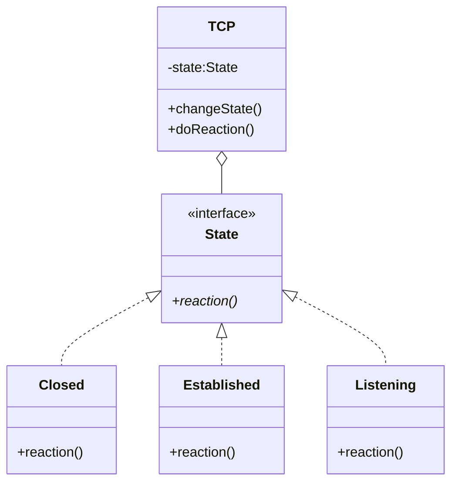
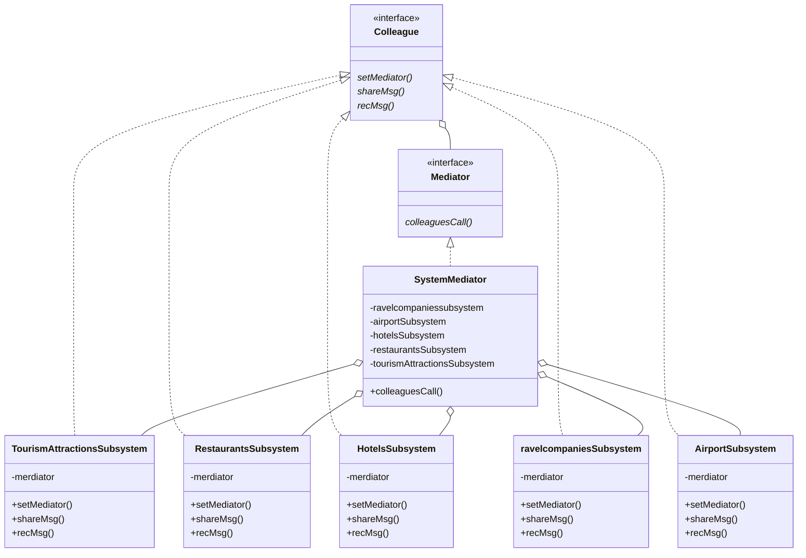
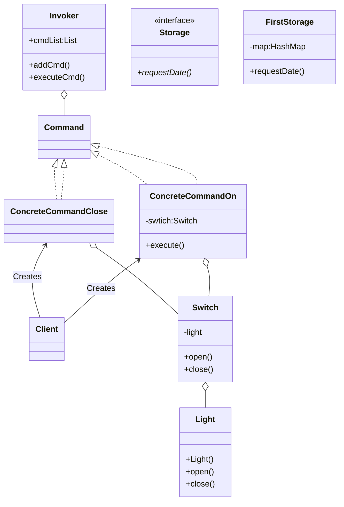
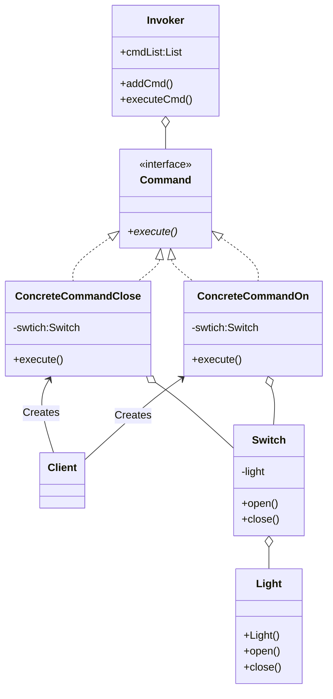
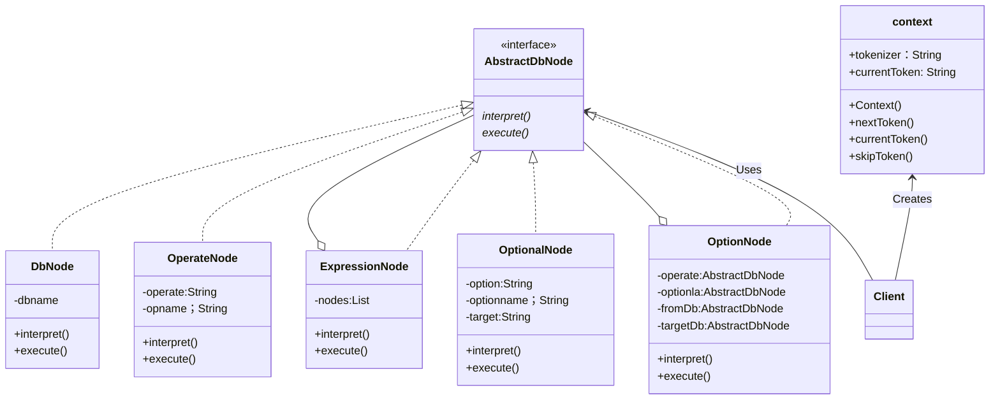

# DesignMode_lab4

## 一 实验目的

1. 结合实例，熟练绘制设计模式结构图。
2. 结合实例，熟练使用 Java 语言实现设计模式。
3. 通过本实验，理解每一种设计模式的模式动机，掌握模式结构，学习如何使用代码实现这些设计模式。

## 二 实验要求

1. 结合实例，绘制设计模式的结构图。
2. 使用 Java 语言实现设计模式实例，代码运行正确。

## 三 实验内容

### 1. 状态模式 

在某网络管理软件中， TCP 连接（TCP Connection）具有建立（Established）、监听
（Listening）、关闭（Closed）等多种状态，在不同的状态下 TCP 连接对象具有不同的行
为，连接对象还可以从一个状态转换到另一个状态。当一个连接对象收到其他对象的请求时，
它根据自身的当前状态做出不同的反应。现采用状态模式对 TCP 连接进行设计，绘制对应
的类图并编程模拟实现。

### 2. 享元模式

某 OA 系统采用享元模式设计权限控制与管理模块，在该模块中，将与系统功能相对
应的业务类设计为享元类并将相应的业务对象存储到享元池中（提示；可使用 Map 实现，
key 为业务对象对应的权限编码， value 为业务对象）。用户身份验证成功后，系统通过
存储在数据库中的该用户的权限编码集从享元池获取相应的业务对象并构建权限列表，在界
面上显示用户所拥有的权限。根据以上描述，绘制对应的类图并编程模拟实现。

### 3. 代理模式

在某电子商务系统中，为了提高查询性能，需要将一些频繁查询的数据保存到内存的辅
助存储对象中（提示：可使用 Map 实现）。用户在执行查询操作时，先判断辅助存储对象
中是否存在待查询的数据，如果不存在，则通过数据操作对象查询并返回数据，然后将效据
保存到辅助存储对象中，否则直接返回存储在辅助存储对象中的数据。现采用代理模式中的
缓冲代理实现该功能，要求绘制对应的类图并编程模拟实现。

### 4. 命令模式

某灯具厂商要生产一个智能灯具遥控器，该遥控器具有 5 个可编程的插槽，每个插槽都
有一个控制灯具的开关，这5个开关可以通过蓝牙技术控制5个不同房间灯光的打开和关闭，
用户可以自行设置每一个开关所对应的房间。现采用命令模式实现该智能遥控器的软件部分，
绘制对应的类图并编程模拟实现。

### 5.解释器模式

某软件公司要为数据库备份和同步开发一套简单的数据库同步指令，通过指令可以对数
据库中的数据和结构进行备份。例如，输入指令“ COPY VIEW FROM srcDB TO desDB ”，
表示将数据库 srcDB 中的所有视图（View）对象都拷贝至数据库 desDB ；输人指令
“ MOVETABLE Student FROM srcDB TO desDB ”，表示将数据库 srcDB 中的 Student 表
移动至数据库 desDB 。现使用解释器模式来设计并编程模拟实现该数据库同步指令系统。

## 四 实验结果

类图如上所示，代码见附件

## 五 实验小结

​	通过本次实验，又新学习到四种设计模式，对于这四种设计模式，其中比较难理解的也是比较复杂的可能是访问者模式，该模式把数据结构和作用于结构上的操作解耦合，使得操作集合可相对自由。访问者模式适用于数据结构相对稳定算法又易变化的系统。因为访问者模式使得算法操作增加变得容易。若系统数据结构对象易于变化，经常有新的[数据对象加进来，则不适合使用访问者模式。在访问者模式双向调用比较难理解，通过反复观看课本，以及去网上搜集资料理解该模式。

